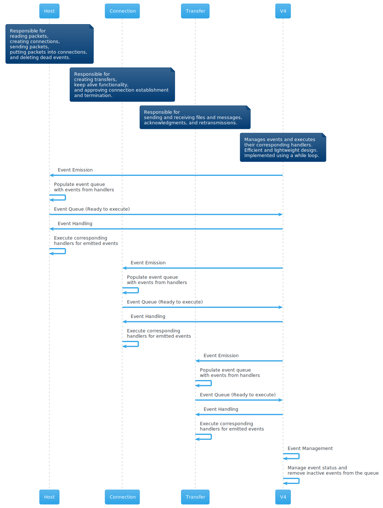
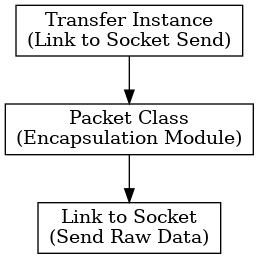

# Table of Contents

- [UDTP (UDP Reliable Transfer Protocol)](#udtp-udp-reliable-transfer-protocol)
- [UDP](#udp)
  * [Why UDP, but not TCP?](#why-udp-but-not-tcp)
  * [UDP Header](#udp-header)
- [General Information](#general-information)
    * [Implementation enviroment and basic tech-implementation information](#implementation-enviroment-and-basic-tech-implementation-information)
    * [Specification](#specification)
        + [IP and ports](#ip-and-ports)
- [Protocol](#protocol)
    * [Header Structure](#header-structure)
    * [Header specification](#header-specification)
        + [Flags](#flags)
            - [Notes](#notes)
        + [Checksum](#checksum)
            - [Example (CRC-16)](#example--crc-16-)
            - [UDP Checksum(RFC 1071)](#udp-checksum-rfc-1071-)
            - [Combined Checksum](#combined-checksum)
    * [Features](#features)
        + [Flow Control (TCP)](#flow-control--tcp-)
        + [Flow Control (UDTP)](#flow-control--udtp-)
- [Protocol rules and conventions](#protocol-rules-and-conventions)
    * [Connection Establishment](#connection-establishment)
    * [Keep Alive](#keep-alive)
    * [Connection Termination](#connection-termination)
- [The application](#the-application)
    * [Not Important](#not-important)
        + [Changing of max frame size](#changing-of-max-frame-size)
        + [Error simulation](#error-simulation)
    * [Specification](#specification-1)
        + [Commands](#commands)
    * [Core Idea](#core-idea)
    * [Core Implementation](#core-implementation)
    * [Core Events Overview](#core-events-overview)
        + [Host - High Level](#host---high-level)
        + [Connection - Medium Level](#connection---medium-level)
        + [Transfer - Low Level](#transfer---low-level)
    * [Balance](#balance)
    * [V4](#v4)
    * [Packet distribution diagrams](#packet-distribution-diagrams)
        


# UDTP (UDP Reliable Transfer Protocol)

 
 

[](mailto:vad.tili@gmail.com)

UDTP is a communication protocol for peer-to-peer data transfer that provides reliable data transfer over UDP and that is easy to implement and understand. :3

UDTP used for transferring files between systems in a local network.

It is designed to be used in situations where TFTP is not suitable, and FTP is too complicated and can not send as quick and as much data as UDTP, if we are talking about FTP on TCP. Also FTP is client-server. 

My protocol in a future can be updated and upgrated, for example, using some ideas i left in own repository. Read more about it in [Improvements.md](Improvements.md).

# UDP

Lets first look at udp, and why do i created another protocol on top of it.

UDP in general is a connectionless protocol, which means that there is no connection between the sender and the receiver before the actual data transfer happens. The sender sends data to the receiver without knowing whether the receiver is ready to receive the data. If the receiver is not ready to receive the data, the data is lost.

UDP is less usable in a network, its fast but not reliable. UDP does not provide any confirmation of packet delivery, any ordering of packets, or any protection against duplication. UDP is used in applications where speed is desirable and error correction is not necessary. For example, UDP is frequently used for live broadcasts and online games.

## Why UDP, but not TCP?

TCP is a connection-oriented protocol, but too much complicated, it has a lot of features, but in a case of file transfer, it is not the best choice. Minimum header size of TCP is 20 bytes, and maximum is 60 bytes. And also an IP header can take up to 60 bytes, so min available payload size is 1380 bytes, and max is 1460 bytes. When UDP is always 8 bytes.

## UDP Header

Image from Wikipedia: 


So UDP header is 8 bytes, in it we can see source port 2 bytes, destination port 2 bytes, length 2 bytes, checksum 2 bytes and payload.

# General Information

## Implementation enviroment and basic tech-implementation information

Protocol UDTP was implemented in Python 3 programming language with using following libraries:


| Name of lib | How do i use it? | Functionality |
|:-----------:|:----------------:|:-------------:|
| time | Get current time, for ttl and timeout | time.time() |
| socket | Create socket, send and receive data | socket.socket() |
| threading | Creted a thread for terminal | threading.Thread() |
| netifaces | Get IP addresses of the interfaces | netifaces.ifaddresses() |
| selectors | For gathering data from sockets | selectors.DefaultSelector() |
| struct | For packing and unpacking data | struct.pack() |
| logging | For logging | logging.basicConfig() |
| crcmod | For CRC16 checksum | crcmod.predefined.Crc('crc-ccitt-false') |
| os | For getting writing and reading files | os.path.exists(), etc. |

## Specification

This project was requested by my university, STU, FIIT. It was requested to create a protocol, which will be able to send and receive files, and also messages. It was requested to use UDP.

BUT, in the task also requested, not only to create a protocol, but also to create an application for it, which will be able to send and receive files and messages. 

The application i made is a CLI application, created on Linux, but it can be easily ported to Windows or MacOS, because i use only standard libraries, which are available on all platforms.

An app is asynchronous, it can send and receive data at the same time. I dont use any `threads` or any `async` libraries, i use 
`selectors` library, which is a part of Python 3.4 and higher.

For communication between apps, they have to know ip and ports of each other. 

### IP and ports
---

IP addresses are taken from the interfaces, so app can work only on existing interfaces. If there are no interfaces, app will not work.

Ports are taken randomly, but they are taken from a range of 49152-65535, because ports from 0-49151 are reserved for system use.

# Protocol

## Header Structure

Mine UDTP protocols header looks like so:

```
---------------------------------------------------------------
| Flags (1 byte) | CRC16 (2 bytes) | Sequence Number (1 byte) |
---------------------------------------------------------------
|                          Payload                            |
---------------------------------------------------------------

```

And full with UDP header:

```
------------------------------------------------------
| Source Port (2 bytes) | Destination Port (2 bytes) |
------------------------------------------------------
|    Length (2 bytes)   |     Checksum (2 bytes)     |
------------------------------------------------------
| Flags (1 byte) | CRC16 (2 bytes) | Seq Num (1 byte)|
------------------------------------------------------
|                      Payload                       |
------------------------------------------------------

```

UDP header is 8 bytes, and UDTP header is 4 bytes, so in a result, my protocol header is 12 bytes.
If IP header is 20 bytes, then max payload size is 1468 bytes, but if IP header is 60 bytes, then max payload size is 1428 bytes.

## Header specification

### Flags

| Flag | Value | Description |
|:----:|:-----:|:-----------:|
| SYN | 0x01 | Synchronize |
| ACK | 0x02 | Acknowledge |
| SACK | 0x04 | Super Acknowledge |
| MSG | 0x08 | Message |
| FILE | 0x10 | File |
| SR | 0x20 | (Send/Receive) Number of Send/Receive objects in real time |
| WM | 0x40 | Window Multiplier |
| FIN | 0x80 | Finish |

#### Notes
---

There are things i wont to clarify about flags.

- SACK - special flag i use in different situations, for example in keep alive packets, or in when i send a file, receiver uses SACK to acknowledge that he starts listening for a file. And many more.

- WM - Window Multiplier flag is employed to communicate to the recipient the availability and intent to use an extended window size, specifically 64 packets. The recipient retains the discretion to either disregard this indication, responding with a basic acknowledgment devoid of the WM flag, signifying mutual agreement on a standard window size of 16 packets. Alternatively, the recipient may acknowledge with the WM flag, indicating a mutual accord to employ the extended window size. It is noteworthy that the current implementation may not exploit the full potential of this flag, leaving room for future utilization, possibly for acknowledgment range or similar enhancements, pending conceptualization.

- SR - Send/Receive, the SR metric is employed as a mechanism to regulate the directionality of packet conversations. This metric aids in discerning whether the packet is intended for sending or receiving purposes, thereby contributing to the effective control and management of communication streams.

Or in more simple words,
I use SR metric to control to what transfer is that packet goes to.

### Checksum
---

CRC or Cyclic Redundancy Check, is a type of checksum algorithm that is used to 
detect errors in  data transmission  or storage.  
The basic idea behind a CRC algorithm is to generate a checksum, or a 
small amount of error-detecting code, based on the data being transmitted.


When the data is received, the receiver can use the same CRC algorithm to generate a checksum based on the received data and compare it to the original checksum. If the two checksums match, the data is assumed to be error-free. 
If they do not match, it indicates that there was an error in transmission and the data may be corrupted.  

---
#### Example: CRC-16 Error Probability Analysis
---

Consider a scenario involving a _1 GB_ file with a packet length of _1428 bytes_, resulting in _700,281_ packets. To determine the probability of a random error going undetected using CRC-16, we apply the following formula:

___P(undetected)=(1−error rate)^(packet count)___

For CRC-16, which has 16 bits, there are 65,536 possible values, yielding an error rate of _1/65,536_ or approximately _0.0000152587890625_ (0.00152587890625%).

Substituting these values into the formula:

___P(undetected)=(1−0.0000152587890625)^700,281___

This computation results in a probability of __2.287372724887968e−05__ or __0.00002287372724887968__. 

Thus, the theoretical probability of a random error going undetected by CRC-16 is approximately 0.002287372724887968. According to this estimate, around 2 packets with errors might __not__ be detected by CRC-16.

It is essential to note that this is a theoretical calculation, and actual outcomes may vary due to multiple factors. The CRC-16 algorithm may effectively identify robust errors, potentially leading to a lower percentage of undetected errors than the theoretical estimation suggests.

| CRC Type | Undetected Error Probability | % Undetected Errors |
|:--------:|:----------------------------:|:-------------------:|
| CRC-8 | 1/2^8 | 0.390625 |
| CRC-16 | 1/2^16 | 0.00152587890625 |
| CRC-32 | 1/2^32 | 0.000000023283064 |
| CRC-64 | 1/2^64 | 5.4 x 10^-20 |

---
#### UDP Checksum
---

The Internet Checksum [RFC 1071](https://tools.ietf.org/html/rfc1071) is a simple checksum algorithm that is used in the Internet Protocol (IP), Transmission Control Protocol (TCP), and User Datagram Protocol (UDP). It is designed to provide a first line of defense against corrupted data, but it is not foolproof. 

The probability of an undetected error for a single bit in Internet Checksum [RFC 1071](https://tools.ietf.org/html/rfc1071) is not explicitly defined in the RFC document. However, it’s important to note that the Internet Checksum is a simple sum of 16-bit words, and it can miss some types of errors that a more robust checksum or CRC might catch.

For example, if two bits in the same position in two different 16-bit words are flipped, the Internet Checksum will not detect this error. 

Im gonna estimate the probability of an undetected errors for the Internet checksum using similar approach:

- The checksum is 16 bits, so it can have 65536 different values. 
- Error rate is 1/65536 = 0.0000152587890625 or 0.00152587890625%.
- The probability of a random error going undetected is (1 - 0.0000152587890625) ^ 700281 = 2.287372724887968e-05 or 0.00002287372724887968.

---
#### Combined Error Probability Analysis
---

__Combined = CRC-16 probability x Internet Checksum probability.__

In evaluating the combined error probability of CRC-16 and Internet Checksum, it's challenging to precisely determine the undetected error rate due to the complex interaction between the two checksum algorithms. While the specifics of their collaborative behavior might be elusive, it's noteworthy that both CRC-16 and Internet Checksum are employed in network protocols like TCP.

As an additional insight, it is acknowledged that TCP utilizes a modified version of [RFC 1071](https://tools.ietf.org/html/rfc1071) and introduces its own adjustments, as outlined in [RFC 1145](https://tools.ietf.org/html/rfc1145). These modifications are intended to improve the error detection capabilities of the Internet Checksum.

Despite that, the probability of an undetected error for TCP is still existent, albeit lower than the theoretical estimate for [RFC 1071](https://tools.ietf.org/html/rfc1071). But it is still existent.

While considering the potential advantages of CRC-32, such as a larger bit space, it's recognized that its increased size and computational demands might not align with my specific requirements. Hence, the decision to opt for CRC-16, with its more manageable size and efficient processing, seems apt for my application. But, if i would want in the future add more reliability, i may consider CRC-32.

In conclusion, the combined error probability of CRC-16 and Internet Checksum represents a multifaceted interplay that, while challenging to quantify precisely, underscores the robustness of error detection mechanisms in network protocols.

## Features

- Flow control
- Fast retransmit
- Selective repeat
- Error simulation
- Retransmission timeout
- Reliable data transfer

### Flow Control (TCP)
---

About Flow Control, basically how it works in TCP? TCP uses a sliding window
protocol to control the flow of data between two hosts. The sender can only
send as much data as the receiver can receive. The receiver advertises the
size of its receive window in the TCP header. The sender can only send as
much data as the receiver's window size. The receiver's window size is
determined by the amount of free space in the receive buffer. The receive
buffer is a fixed size and is determined by the operating system. 

TCP uses a combination of the Go-Back-N and Selective Repeat mechanisms.  
This hybrid approach is known as Selective Repeat with Selective Acknowledgments (SACK).

- With SACK, the receiver can acknowledge individual out-of-order segments, allowing the sender to retransmit only the missing segments rather than the entire window.
    
- This improves efficiency compared to pure Go-Back-N, especially in the presence of network conditions causing occasional packet loss or reordering.

In a TCP communication scenario, consider the following example of flow control:

    1. Receiver's Window Size: 10 Packets
        - The sender dispatches 10 packets of data to the receiver.
        - The receiver successfully receives packets 1, 2, 3, and 6 to 10.

    2. Acknowledgment by Receiver:
        - The receiver acknowledges the receipt of packets. This acknowledgment can take two forms:
            - Without SACK:
                The receiver sends an ACK3.
                If a packet is missing (e.g., packet 4), the sender will retransmit all subsequent packets (4 to 10).
            - With SACK (Selective Acknowledgment):
                The receiver sends ACK3 along with SACK6-10.
                The sender, upon receiving this information, recognizes that only packets 4 and 5 need retransmission.

    3. Efficiency with SACK:
        - When SACK is employed, the sender, knowing that only packets 4 and 5 need retransmission, can use the available window space more efficiently.
        - The sender retransmits only packets 4 and 5, allowing for additional space to transmit 8 new packets.

    4. Total Packets Transmitted:
        - In this scenario, the total number of packets transmitted remains at or below the receiver's window size (10 packets). This is due to the efficiency gained by retransmitting only the necessary packets, leaving room for new data.

### Flow Control in UDTP Protocol (Selective Repeat):
---

In the UDTP (UDP Reliable Transfer Protocol) the flow control mechanism is based on a modified version of Selective Repeat. Here's how it operates:

1. Sender Action:

    - The sender initiates the communication by dispatching a set of packets to the receiver, with the window size set to 10 packets in this example.
    - Each packet is assigned a Time-to-Live (TTL), and the sender awaits acknowledgments from the receiver.

2. Receiver Acknowledgment:

    - The receiver acknowledges the successfully received packets individually. For example, if packets 1, 2, 3, 6, 7, 8, 9, and 10 are received without errors, the receiver sends ACK1, ACK2, ACK3, ACK6, ACK7, ACK8, ACK9, and ACK10.

3. Sender Response:

    - Upon receiving these acknowledgments, the sender interprets them and recognizes which packets were successfully received by the receiver.
    - The sender can then proceed to send an additional 8 packets, considering the window size and the successful acknowledgments.

4. Retransmission on Timeout:

    - The sender incorporates a Time-to-Live (TTL) for each packet. If the sender does not receive acknowledgments within the specified TTL, it retransmits the corresponding packets.

5. Error Handling:

    - If the receiver encounters a corrupted packet, it discards the packet without notifying the sender. The sender, relying on the lack of acknowledgment, initiates retransmission as per the TTL.


In essence, the receiver's role is simplified to sending individual acknowledgments for successfully received packets. The sender, guided by these acknowledgments and the TTL, dynamically manages the transmission of new packets and handles retransmissions when necessary. The protocol aims to maintain efficient communication while providing reliability through selective repeat and automatic retransmission.

Here is a visual representation of the flow control mechanism in UDTP:


# Protocol rules and conventions

## Connection Establishment

Connection establishment is a process that is used to set up a connection between the peers. Starts same as TCP, with 3-way handshake, but it is slightly different.

- Peer A sends SYN packet to Peer B.
- Peer B sends SYN-ACK packet to Peer A.
- Peer A sends SYN-SACK packet to Peer B.

After that, connection is established, and peers can send data to each other.

1. If Peer B didnt recv SYN packet, Peer A with keep alive func, will resend SYN packet, until Peer B will get it.

2. If Peer B didnt recv SYN-SACK packet, Peer A with keep alive func, will resend SYN-SACK packet, until Peer B will get it.

For All that part of keep alive func, if they could connect in 3 seconds, they cuts off connection.

Without Connection Establishment, peers can not send data to each other.

Here is a visual representation of the connection establishment mechanism in UDTP:


## Keep Alive

Keep Alive is a function, which is used to keep connection alive, and to check if peer is still alive. If keep alive func in connection establishment part, and peers didnt be able to connect in 3 seconds, keep alive func will cut off connection.

If peers are connected and dont send or recv any data, keep alive func will send keep alive packets to each other, SYN-SACK packets. Keep alive timeout is `10` seconds, but all that kinda magic numbers can be set in `config files`* of the app.

If peer didnt get any packet in `30` seconds, keep alive func will cut off connection.

## Connection Termination

Connection termination is a process that is used to terminate a connection between the peers. If peer B get FIN flag with no data, it means that peer A wants to terminate connection. So peer B send FIN in responce. If Connection room isnt removed by garbage collector, and it still exists, if peer B answered with his FIN, but peer A didnt get it, and if peer A again send FIN, peer B will again send FIN, but if there isnt any more this connection room. Then room will be created answered with FIN and make that room dead.

But if data isnt empty that means that fin goes to transfer room. (Transfer is over). Read more in [Transfer.md](Transfer.md).

Here is a visual representation of the connection termination mechanism in UDTP:


# The application

## Not Important

### Changing of max frame size

My protocol always sends packets of 1B, but the peer app, that sends files and msg, can change the max bytes they can send. Minimum is 1B, maximum is 1468B. The change is applied only on new transfers, so if there are already some transfers, they will not be affected by this change.

### Error simulation

My protocol can simulate errors, like packet loss, packet corruption, packet duplication. It can be done by changing the `config files`*.

1. Packet loss - by that i mean, that on sender side, i wont send some packets once.

2. Packet corruption - by that i mean, that on sender side, i will change some bits in packet. (CRC16 will not match)

3. Packet duplication - by that i mean, that on sender side, i will send some packets twice.

## Specification

The application for now its only cli, but still there are some commands, which can be used to interact with the app. 

```

Available commands:
  my_address: Display the host's address
  connect <ip>:<port>: Connect to a host
  disconnect <ip>:<port>: Disconnect from a host
  disconnect_all: Disconnect from all hosts
  list: List connected hosts
  list_available: List available hosts
  detection_time <time>: Set the detection time of available hosts
  send_m <ip>:<port> <message>: Send a message to a host
  send_f <ip>:<port> <file>: Send a file to a host
  change_fragment_size <size>: Change the fragment size
  log_level <level>: Set the log level
  help: Display this help message
  exit: Exit the terminal

```

### Commands

Ill go through only important commands.

- `list` - list of connected peers.
- `list_available` - list of peers that are running UDTP app.
- `detection_time` - time in seconds, how often app will check for new peers that are running UDTP app.
- `send_m` - send message to peer. Where __message__ is a message.
- `send_f` - send file to peer. Where __file__ is a path to a file.
- `change_fragment_size` - change max frame size. Where __size__ is a size of a frame 1-1468 bytes.
- `log_level` - change log level. Where __level__ is a level of logging. 0 - DEBUG, 1 - INFO, 2 - WARNING, 3 - ERROR, 4 - CRITICAL.

If i wasnt able to do terminal without separate thread i would do that, but it is what it is. I used `threading` library for that.

So i have running cli in diff thread, that is listening on commands from user and sending them to core app. Where is the main logic running.

## Core Idea

The foundational concept for this project was inspired by Node.js, particularly the utilization of the `EventEmitter` class, which facilitates the emission and reception of events. I found this pattern highly effective and wished to incorporate it into my work.

Additionally, I drew inspiration from the core principles of libuv, V8, and Go. In particular, I sought to implement a design similar to Node.js in Python. To achieve this, I developed my own GO (Generic Object), choosing a simplified `v4` version as an alternative to the more intricate V8 engine. This choice was made to strike a balance between the efficiency of V8 and the complexity associated with it.

Rather than relying on libuv, I employed the selectors library, specifically utilizing the DefaultSelector. It's important to note that, in contrast to libuv's asynchronous features, I opted for the synchronous version of selectors. This decision was driven by the specific nature of my application, which involves a singular socket and doesn't necessitate asynchronous functionality.

In summary, my implementation draws inspiration from various sources, melding the event-driven paradigm of Node.js, the efficiency principles of libuv, and the simplicity of design found in Go. This amalgamation has culminated in a Python-based solution that aligns with the specific requirements of my project, delivering an effective and tailored approach to event handling and socket management.

## Core Implementation

V4 functionality is the same as [V8](https://nodejs.org/en/learn/getting-started/the-v8-javascript-engine).

In the architecture of my application, events can execute distinct tasks related to their parent elements. The application comprises several hierarchical levels:

1. Host (Top Level):
    - Responsible for core functionality such as socket reading.
    - Maintains a list of Connections.
    - Runs v4 loop.

2. Connection (Second Level):
    - Created for each new user, representing their specific connection.
    - Maintains a list of Transfers.

3. Transfer (Last Level):
    - Created for each new transfer, establishing a specific transfer room.
    - Maintains a list of Packets.

To illustrate:

    Host -> V4:
        V4 manages events.
        Host reads data from socket.

    Connection:
        Manages individual user connections and maintains a list of Transfers.

    Transfer:
        Manages specific transfer rooms and maintains a list of Packets.

Each new instance of these classes generates its own event emitter, which is invoked within the V4 context. This hierarchical structure allows for modular and organized event handling throughout the application.

> p.s. Host can be created only once, and it is created when app starts.

## Core Events Overview

In the core architecture, events are emitted and processed by the V4 loop, where the corresponding event handlers are executed. A Status module has been introduced to manage the state of events, categorizing them as busy, sleeping, or inactive and more.

Each event operates within its designated level and is constrained from traversing upward. While an event can pass a packet to the level above, it cannot surpass its allocated level.

### Host - High Level
---

This layer is responsible for reading packets from a socket, create connections, sending packets, putting packets into a connections, and deleted dead events from a v4 loop.

### Connection - Medium Level
---

This layer is responsible for creating transfers, keep alive funcitonality, and approving connection establishment and termination.

### Transfer - Low Level
---

This layer is responsible for sending and receiving files, and messages, acknowledgments, and retransmissions.

## Balance

The current design allows for efficient socket reading, considering the workload and available packets. The system is configured to read from the socket if it is not busy and there are packets available. Presently, this operation is limited to a maximum of 16 iterations, a value that remains __adjustable for future optimizations__. This approach ensures a balance between effective socket handling and system resources, providing flexibility for potential adjustments as the project evolves.

## V4

The V4 loop is responsible for managing events and executing their corresponding handlers. It is designed to be efficient and lightweight, with a focus on performance and simplicity. The V4 loop is implemented using a `while` loop, which is executed until the application is terminated. The loop is comprised of three primary components:

1. Event Emission:
    - The loop emits events from the event queue, which is populated by the event handlers.
    - The event queue is a list of events that are ready to be executed.
    - The event queue is populated by the event handlers, which are executed by the loop.

2. Event Handling:
    - The loop handles events by executing their corresponding handlers.
    - The event handlers are functions that are executed by the loop.
    - The event handlers are executed by the loop.

3. Event Management:
    - The loop manages events by maintaining their status and removing inactive events.
    - The event status is managed by the emitter.
    - The loop removes inactive events from the event queue.

Here is a visual representation of the V4 loop:



## Packet distribution diagrams

| Data Received | Data Sent | 
|:-------------:|:---------:|
|  |  |

## Data Transfer

See [Transfer.md](Transfer.md) for more information about data transfer.

Here is a visual representation of the data transfer mechanism in UDTP:

